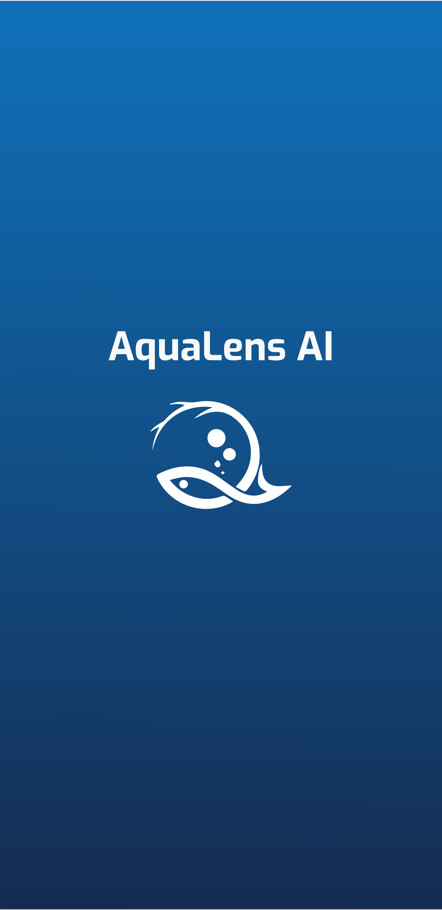
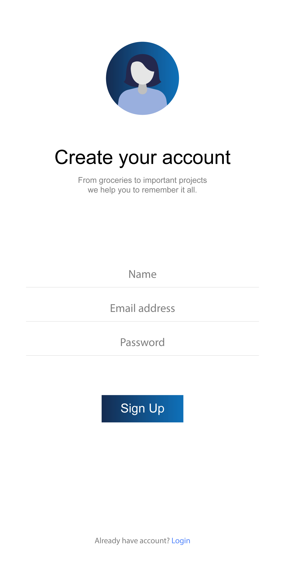
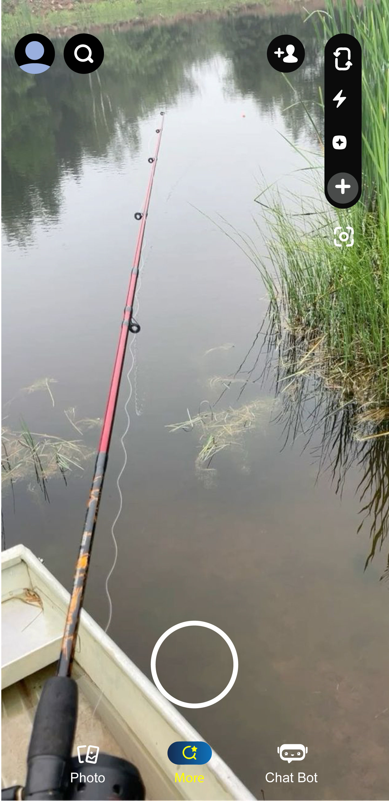
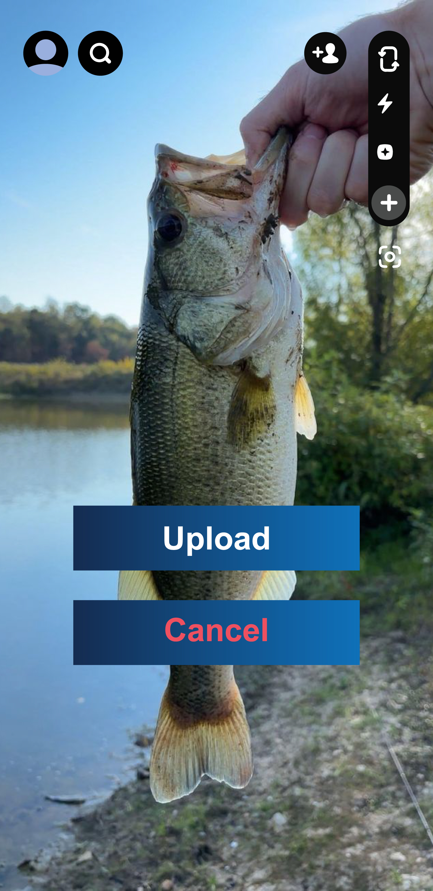
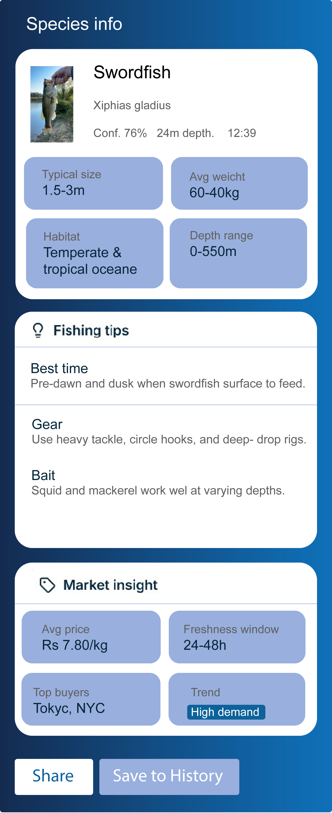
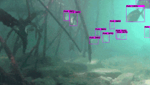

# AquaLens AI 🐟

An offline-first Android application that uses on-device AI to provide real-time identification, health assessment, and volume estimation of fish catch. This project was developed as a solution for the Smart India Hackathon (SIH).


---

## 📋 Table of Contents

- [Key Features](#-key-features)
- [Unique Features](#-unique-features)
- [Technology Stack](#-technology-stack)
- [Getting Started](#-getting-started)
  - [Prerequisites](#prerequisites)
  - [Installation & Setup](#installation--setup)
- [Project Structure](#-project-structure)
- [AI/ML Models](#-aiml-models)

---

## ✨ Key Features

A set of cards summarizing the core functionalities of the application.

| Feature                      | Description                                                                                                                              |
| ---------------------------- | ---------------------------------------------------------------------------------------------------------------------------------------- |
| **Instant, All-in-One Analysis** | Get real-time results for species, quality, and quantity in a single scan, replacing subjective manual checks with consistent AI analysis. |
| **Fully Offline Operation** | Guarantees 100% functionality on fishing vessels and at remote landing sites, independent of unreliable internet or mobile data.      |
| **Simple Point-and-Shoot UI** | Designed to be as intuitive as taking a photo, requiring minimal user training with clear, visual results displayed on-screen.        |
| **Secure Digital Records** | Automatically creates a verifiable audit trail with a GPS location and timestamp for every catch, ensuring traceability.               |
| **Empowering Fishermen** | Provides objective, data-driven proof to support fair pricing and negotiations, building trust and reducing market conflicts.            |
| **Enhancing Sustainability** | Generates crucial, real-time data to help authorities monitor fishing activity and support policies for marine ecosystem health.     |
| **Highly Accessible Tech** | Works on standard Android smartphones, eliminating the need for any special hardware and making advanced AI tools affordable for all.  |
| **Adaptable & Scalable** | The AI can be easily trained to recognize new aquatic species (like shrimp or crabs), making it a future-proof solution for diverse fisheries. |

---

## 📸 App Preview

Here's a look at the AquaLens AI application in action.

| **Intro Screen & Logo** | **Login Page** |
| :-------------------------: | :------------------: |
|  |  |
| **Main Screen** | **Upload Image Screen** |
|  |  |
| **Fish/Species Info Screen** | **App Demo (GIF)** |
|  |  |

---

## 🚀 Unique Features

These are planned extensions to make the app even more powerful:

- **Real-Time Market Price Integration:** Pulls live market prices for the identified catch based on the user's location, providing instant knowledge of its value for strong bargaining power.
- **Restricted & Endangered Species Alert:** Instantly alerts the user with a visual warning if an endangered or legally undersized fish is detected, helping prevent fines and support conservation.
- **AI-Powered Image Upscaling:** Enhances blurry or low-resolution photos from the gallery using an AI model, improving analysis accuracy on poor-quality uploaded images.

---

## 🛠️ Technology Stack

This project is built with a modern, native Android stack.

- **Frontend:**
  - **Kotlin:** The primary, modern language for native Android app development.
  - **Jetpack Compose:** The declarative UI toolkit for building a responsive and modern user interface.
- **Data and AI/ML:**
  - **TensorFlow Lite:** The core framework for deploying and running highly optimized machine learning models directly on the Android device.
  - **Python (with TensorFlow/Keras):** Used for training and converting the AI models before mobile deployment.
- **Database:**
  - **SQLite & Room:** For robust, on-device, offline data storage and management.
- **Integration and APIs:**
  - **CameraX API:** For accessing and managing the device's camera feed to process live video frames.
  - **Android Location Services (GPS):** For automatic geotagging of every catch log.

---

## 🏁 Getting Started

Follow these instructions to get the project up and running on your local machine for development and testing purposes.

### Prerequisites

- **Android Studio** (Hedgehog 2023.1.1 or newer is recommended)
- **JDK 17** (This is now bundled with the latest versions of Android Studio)
- An Android device or emulator running **API level 26 or higher**.

### Installation & Setup

1.  **Clone the repository**
    ```sh
    git clone [https://github.com/your-username/your-repository-name.git](https://github.com/your-username/your-repository-name.git)
    ```
    *(Replace the URL with your actual repository link)*

2.  **Download the AI Model**
    This project requires a TensorFlow Lite object detection model.
    - Download a pre-trained model like `yolov8n_float16.tflite`.
    - Place the downloaded `.tflite` file inside the `app/src/main/assets/` directory. **The app will not build without a model file here.**

3.  **Open in Android Studio**
    - Open Android Studio.
    - Click on `File > Open` and select the cloned project directory.
    - Wait for Gradle to sync all the project dependencies.

4.  **Run the Application**
    - Connect an Android device or start an emulator.
    - Click the 'Run' button (▶️) in Android Studio.

---

## 📂 Project Structure

A brief overview of the key files and directories in this project.
```
AquaLensAI/
└── app/
└── src/
└── main/
├── java/com/example/myapplication/
│   ├── ui/
│   │   └── theme/
│   │       ├── Color.kt          # Color definitions for the app
│   │       ├── Theme.kt          # App theme configurations
│   │       └── Type.kt           # Typography definitions
│   ├── MainActivity.kt           # Main UI, CameraX setup, and result display
│   └── ObjectDetector.kt         # Handles TFLite model loading and inference
│
├── assets/
│   └── model.tflite              # <-- PLACE YOUR TFLITE MODEL HERE
│
├── res/
│   ├── drawable/                 # Image and drawable resources
│   ├── mipmap/                   # App icons for different densities
│   ├── values/                   # XML files for colors, strings, themes
│   │   ├── colors.xml
│   │   ├── strings.xml
│   │   └── themes.xml
│   └── xml/                      # Miscellaneous XML resources
│
└── AndroidManifest.xml           # App manifest file
```
---

## 🧠 AI/ML Models

The core of this application is a pipeline of on-device TFLite models:

1.  **Object Detection:** Uses a lightweight model like **YOLOv8-Tiny** or **MobileNet-SSD** to find the location of each fish in the camera frame.
2.  **Species Classification:** A cropped image of each detected fish is passed to an efficient classification model like **EfficientNet-Lite** to identify the species.
3.  **Health Assessment:** The same cropped image is passed to a custom-trained **MobileNetV3** model to assess freshness and quality based on visual indicators.
